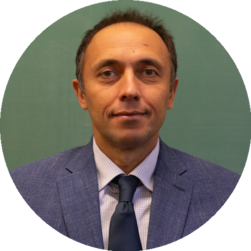

# Mahir Bilen Can

  

Professor of Mathematics at Tulane University (on leave). Senior Quantum Architecture Scientist at Xanadu Quantum Technologies since June 2026.

This repository hosts my personal academic website, including research interests, publications, professional activities, teaching, students, and contact information.

## About

My work focuses on algebraic groups and monoids, representation theory, algebraic geometry, and applications to coding theory, secure communication, and quantum error correction.

## Quick Links

- Website: [mahirbilencan.github.io](https://mahirbilencan.github.io/)
- Publications: [Publications page](https://mahirbilencan.github.io/publications/)
- Research, Industry & Service: [CV page](https://mahirbilencan.github.io/cv/)
- CV: [CV (PDF)](https://mahirbilencan.github.io/assets/pdf/CV.pdf)
- Email: [mcan@tulane.edu](mailto:mcan@tulane.edu)

## Profiles

- ORCID: [0000-0002-0175-4897](https://orcid.org/0000-0002-0175-4897)
- arXiv: [can_m_1](https://arxiv.org/a/can_m_1)
- Google Scholar: [Citation profile](https://scholar.google.com/citations?user=jbvQXE4AAAAJ&hl=en&oi=ao)

## Development

Built with [al-folio](https://github.com/alshedivat/al-folio) (Jekyll). Publications live in `_bibliography/papers.bib`; pages in `_pages/`; site identity in `_config.yml` and `_data/socials.yml`.

To preview locally: make sure Docker Desktop is running, then run `npm run dev` and open `http://localhost:8080`. Stop with `npm run dev:stop`. The previous Astro site is preserved at the git tag `astro-site-final`.
